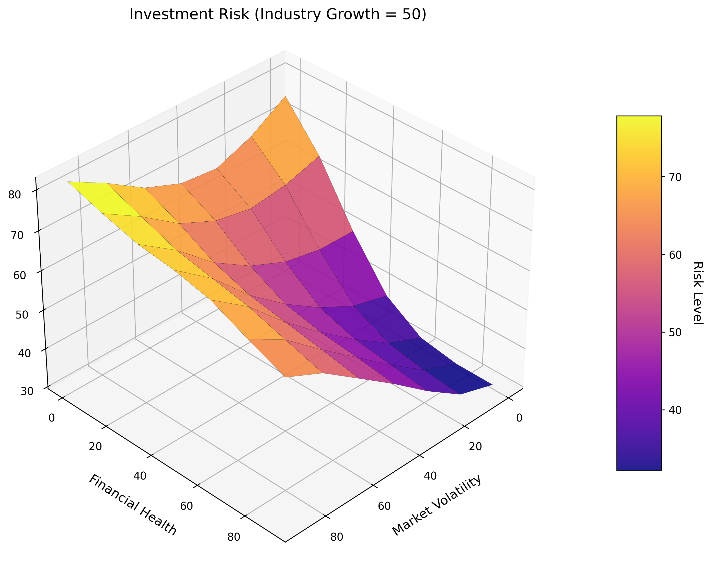

# System oceny ryzyka inwestycji oparty na logice rozmytej

## Wprowadzenie

System wspomagania decyzji inwestycyjnych opracowany w ramach tego projektu wykorzystuje logikę rozmytą do modelowania niejednoznaczności i niepewności występujących w procesach decyzyjnych związanych z inwestycjami.

## Zmienne lingwistyczne i funkcje przynależności

System wykorzystuje trzy zmienne wejściowe i jedną zmienną wyjściową.

### Zmienne wejściowe

#### 1. Zmienność rynku (market_volatility)

Zmienność rynku odzwierciedla poziom nieprzewidywalności i wahań na rynku, na którym działa przedsiębiorstwo.

**Funkcje przynależności:**

-   Niska (low): funkcja Gaussa z centrum w 10 i szerokością 15
-   Średnia (medium): funkcja Gaussa z centrum w 50 i szerokością 15
-   Wysoka (high): funkcja Gaussa z centrum w 90 i szerokością 15

#### 2. Kondycja finansowa przedsiębiorstwa (financial_health)

Kondycja finansowa ocenia stabilność i siłę finansową przedsiębiorstwa.

**Funkcje przynależności:**

-   Słaba (poor): funkcja Z-kształtna z parametrami [20, 40]
-   Przeciętna (average): funkcja Gaussa z centrum w 50 i szerokością 15
-   Doskonała (excellent): funkcja S-kształtna z parametrami [60, 80]

#### 3. Potencjał wzrostu branży (industry_growth)

Potencjał wzrostu branży określa perspektywy rozwojowe sektora, w którym działa przedsiębiorstwo.

**Funkcje przynależności:**

-   Spadek (declining): funkcja dzwonowa (gbellmf) z parametrami [20, 2, 10]
-   Stabilność (stable): funkcja dzwonowa (gbellmf) z parametrami [20, 2, 50]
-   Dynamiczny wzrost (booming): funkcja dzwonowa (gbellmf) z parametrami [20, 2, 90]

### Zmienna wyjściowa

#### Ocena ryzyka inwestycji (investment_risk)

Ocena ryzyka inwestycji określa poziom bezpieczeństwa lub ryzyka związanego z daną inwestycją.

**Funkcje przynależności:**

-   Bardzo bezpieczna (very_safe): funkcja Gaussa z centrum w 10 i szerokością 10
-   Bezpieczna (safe): funkcja Gaussa z centrum w 30 i szerokością 10
-   Umiarkowane ryzyko (moderate): funkcja Gaussa z centrum w 50 i szerokością 10
-   Ryzykowna (risky): funkcja Gaussa z centrum w 70 i szerokością 10
-   Bardzo ryzykowna (very_risky): funkcja Gaussa z centrum w 90 i szerokością 10

## Baza reguł

System zawiera 18 reguł wnioskowania, które obejmują różne kombinacje zmiennych wejściowych i określają odpowiednie wartości zmiennej wyjściowej. Poniżej przedstawiono kilka przykładowych reguł:

1. JEŻELI zmienność rynku jest niska I kondycja finansowa jest doskonała I potencjał wzrostu branży jest dynamiczny, TO ryzyko inwestycji jest bardzo bezpieczne.

2. JEŻELI zmienność rynku jest niska I kondycja finansowa jest doskonała I potencjał wzrostu branży jest stabilny, TO ryzyko inwestycji jest bezpieczne.

3. JEŻELI zmienność rynku jest średnia I kondycja finansowa jest przeciętna I potencjał wzrostu branży jest stabilny LUB dynamiczny, TO ryzyko inwestycji jest umiarkowane.

4. JEŻELI zmienność rynku jest wysoka I kondycja finansowa jest słaba, TO ryzyko inwestycji jest bardzo ryzykowne.

Pełny zestaw reguł znajduje się w kodzie źródłowym systemu.

## Metoda defuzyfikacji

W projekcie zastosowano metodę centroidu (środka ciężkości) do defuzyfikacji. Jest to jedna z najbardziej popularnych metod defuzyfikacji, która oblicza wartość wyjściową jako środek ciężkości obszaru pod krzywą funkcji przynależności zmiennej wyjściowej.

## Przykładowe wnioskowanie

Aby zilustrować działanie systemu, przeprowadzono analizę trzech przykładowych scenariuszy inwestycyjnych:

### Scenariusz 1: Niska zmienność rynku, doskonała kondycja finansowa, dynamiczny wzrost branży

-   Zmienność rynku: 20
-   Kondycja finansowa: 80
-   Potencjał wzrostu branży: 90
-   **Wynik oceny ryzyka: 16.67/100 (Bardzo bezpieczna inwestycja)**

### Scenariusz 2: Średnia zmienność rynku, przeciętna kondycja finansowa, stabilny wzrost branży

-   Zmienność rynku: 50
-   Kondycja finansowa: 50
-   Potencjał wzrostu branży: 50
-   **Wynik oceny ryzyka: 49.72/100 (Umiarkowane ryzyko inwestycji)**

### Scenariusz 3: Wysoka zmienność rynku, słaba kondycja finansowa, spadek branży

-   Zmienność rynku: 80
-   Kondycja finansowa: 30
-   Potencjał wzrostu branży: 20
-   **Wynik oceny ryzyka: 87.57/100 (Bardzo ryzykowna inwestycja)**

## Wizualizacja wyników

System generuje następujące wizualizacje:

1. **Funkcje przynależności** - dla wszystkich zmiennych wejściowych i wyjściowej, pokazujące kształty funkcji wykorzystujących modele Gaussa, Z-kształtne, S-kształtne i dzwonowe.

2. **Wykresy konturowe** - pokazujące poziomy ryzyka dla różnych kombinacji zmienności rynku i kondycji finansowej, przy trzech różnych poziomach potencjału wzrostu branży (10 - spadek, 50 - stabilność, 90 - dynamiczny wzrost).

3. **Wykres powierzchniowy 3D** - pokazujący zależność między zmiennością rynku, kondycją finansową a ryzykiem inwestycyjnym przy stałym poziomie potencjału wzrostu branży równym 50 (stabilność).

### Wykresy funkcji przynależności dla poszczególnych zmiennych

#### Zmienność rynku

Na powyższym wykresie przedstawiono funkcje przynależności dla zmiennej "Zmienność rynku":

-   **Niska** (kolor niebieski): funkcja Gaussa z centrum w punkcie 10
-   **Średnia** (kolor pomarańczowy): funkcja Gaussa z centrum w punkcie 50
-   **Wysoka** (kolor zielony): funkcja Gaussa z centrum w punkcie 90

**Interpretacja:**
Funkcje Gaussa dla zmienności rynku zapewniają symetryczne i płynne przejścia między kategoriami. Widoczne jest optymalne pokrycie przestrzeni decyzyjnej, z największym nakładaniem się w środkowych obszarach wartości (40-60), gdzie niepewność oceny jest największa. Taki kształt funkcji dobrze modeluje płynne przejścia między poziomami zmienności, co odpowiada rzeczywistemu, nieostro określonemu sposobowi postrzegania zmienności rynkowej.

#### Kondycja finansowa

Na powyższym wykresie przedstawiono funkcje przynależności dla zmiennej "Kondycja finansowa":

-   **Słaba** (kolor niebieski): funkcja Z-kształtna z parametrami [20, 40]
-   **Przeciętna** (kolor pomarańczowy): funkcja Gaussa z centrum w punkcie 50
-   **Doskonała** (kolor zielony): funkcja S-kształtna z parametrami [60, 80]

**Interpretacja:**
Na wykresie widoczna jest asymetria funkcji przynależności - łatwiej jest jednoznacznie określić "słabą" kondycję finansową niż precyzyjnie rozróżnić między "przeciętną" i "doskonałą". Funkcje Z-kształtna i S-kształtna modelują asymetryczne zjawiska, gdzie przejście między kategoriami nie jest symetryczne. Taki wybór funkcji lepiej odpowiada rzeczywistości ekonomicznej, gdzie często jednoznaczniej można określić słabą kondycję finansową (np. na podstawie wskaźników zadłużenia i płynności) niż precyzyjnie rozgraniczyć kondycję przeciętną od doskonałej.

#### Potencjał wzrostu branży

Na powyższym wykresie przedstawiono funkcje przynależności dla zmiennej "Potencjał wzrostu branży":

-   **Spadek** (kolor niebieski): funkcja dzwonowa z parametrami [20, 2, 10]
-   **Stabilność** (kolor pomarańczowy): funkcja dzwonowa z parametrami [20, 2, 50]
-   **Dynamiczny wzrost** (kolor zielony): funkcja dzwonowa z parametrami [20, 2, 90]

**Interpretacja:**
Funkcje dzwonowe dla potencjału wzrostu branży zapewniają ostre rozgraniczenie między kategoriami, co wskazuje na możliwość bardziej zdecydowanej klasyfikacji w tej zmiennej. Funkcje te oferują węższe zakresy centralnych wartości, co odpowiada bardziej precyzyjnemu określeniu stabilności branży. Wyraźnie widać, że trzy stany (spadek, stabilność, wzrost) są dobrze rozróżnialne, z niewielkim nakładaniem się w obszarach przejściowych, co dobrze modeluje sposób, w jaki eksperci klasyfikują trendy rozwojowe branż.

#### Ryzyko inwestycji

Na powyższym wykresie przedstawiono funkcje przynależności dla zmiennej wyjściowej "Ryzyko inwestycji":

-   **Bardzo bezpieczne** (kolor niebieski): funkcja Gaussa z centrum w punkcie 10
-   **Bezpieczne** (kolor pomarańczowy): funkcja Gaussa z centrum w punkcie 30
-   **Umiarkowane** (kolor zielony): funkcja Gaussa z centrum w punkcie 50
-   **Ryzykowne** (kolor czerwony): funkcja Gaussa z centrum w punkcie 70
-   **Bardzo ryzykowne** (kolor fioletowy): funkcja Gaussa z centrum w punkcie 90

**Interpretacja:**
Dla ryzyka inwestycji równomierne rozłożenie pięciu funkcji Gaussa zapewnia płynne przejście między kategoriami ryzyka. Zastosowanie pięciu kategorii zamiast trzech pozwala na bardziej precyzyjne określenie poziomu ryzyka, co jest szczególnie ważne przy podejmowaniu decyzji inwestycyjnych. Zauważalne jest optymalne nakładanie się funkcji, co pozwala na modelowanie stopniowego przejścia między poszczególnymi poziomami ryzyka i lepiej odpowiada rzeczywistym ocenom ekspertów, którzy rzadko klasyfikują ryzyko w sposób binarny.

### Zbiorczy wykres funkcji przynależności

Poniżej przedstawiono zbiorcze funkcje przynależności dla wszystkich zmiennych wejściowych i wyjściowej:

Na powyższym wykresie widoczne są:

-   Funkcje przynależności dla zmienności rynku (pierwsze od góry)
-   Funkcje przynależności dla kondycji finansowej (drugie od góry)
-   Funkcje przynależności dla potencjału wzrostu branży (trzecie od góry)
-   Funkcje przynależności dla ryzyka inwestycji (ostatnie na dole)

**Interpretacja:**
Zbiorczy wykres funkcji przynależności potwierdza dobre dopasowanie funkcji do modelowanych zjawisk, pokazując jak wszystkie zmienne współdziałają w systemie. Widać wyraźnie różnice w kształcie funkcji przynależności dla poszczególnych zmiennych, co odzwierciedla różny charakter modelowanych zjawisk. Kompleksowe podejście do modelowania wszystkich zmiennych zapewnia spójny system wnioskowania rozmytego, gdzie każdy aspekt oceny ryzyka inwestycyjnego jest adekwatnie reprezentowany.

### Wykresy konturowe

Poniżej przedstawiono wykresy konturowe pokazujące zależność ryzyka inwestycyjnego od zmienności rynku i kondycji finansowej przy trzech różnych poziomach potencjału wzrostu branży:

Na wykresach wyraźnie widać, jak zmienia się ryzyko inwestycyjne w zależności od kombinacji zmienności rynku (oś X) i kondycji finansowej (oś Y) przy:

-   Potencjale wzrostu branży = 10 (spadek) - pierwszy wykres
-   Potencjale wzrostu branży = 50 (stabilność) - środkowy wykres
-   Potencjale wzrostu branży = 90 (dynamiczny wzrost) - ostatni wykres

Jaśniejsze kolory oznaczają wyższe ryzyko, ciemniejsze - niższe ryzyko inwestycyjne.

**Interpretacja:**
Wykresy konturowe ujawniają istotne zależności:

-   Przy spadającej branży (pierwszy wykres) nawet dobra kondycja finansowa nie jest w stanie całkowicie zniwelować ryzyka inwestycyjnego przy wysokiej zmienności rynku. Obszar niskiego ryzyka jest najmniejszy i ogranicza się do lewego górnego rogu (niska zmienność, doskonała kondycja).

-   W przypadku stabilnej branży (środkowy wykres) istnieje wyraźna "bezpieczna strefa" w lewym górnym rogu (niska zmienność, dobra kondycja), gdzie ryzyko jest minimalne. Widoczna jest także większa tolerancja na zmienność rynku przy dobrej kondycji finansowej.

-   Dla rozwijającej się branży (ostatni wykres) bezpieczna strefa jest znacznie większa, co potwierdza pozytywny wpływ potencjału wzrostu na ocenę ryzyka. Nawet przy średniej zmienności rynku i dobrej kondycji finansowej ryzyko pozostaje na akceptowalnym poziomie.

Zestawienie trzech wykresów pokazuje, jak silny wpływ ma potencjał rozwojowy branży na ostateczną ocenę ryzyka, szczególnie w połączeniu z innymi czynnikami.

### Wykres powierzchniowy 3D

Poniżej przedstawiono wykres powierzchniowy 3D pokazujący zależność między zmiennością rynku, kondycją finansową a ryzykiem inwestycyjnym przy stałym poziomie potencjału wzrostu branży równym 50 (stabilność):

Wykres ten pozwala na przestrzenną wizualizację wpływu zmienności rynku i kondycji finansowej na ryzyko inwestycyjne. Wysokość powierzchni odpowiada poziomowi ryzyka - im wyżej, tym wyższe ryzyko inwestycyjne.

**Interpretacja:**
Na wykresie powierzchniowym 3D można zauważyć:

-   Wyraźne "doliny" niskiego ryzyka w obszarze niskiej zmienności i dobrej kondycji finansowej, co potwierdza, że kombinacja tych czynników prowadzi do najbezpieczniejszych inwestycji.

-   Strome "zbocza" wskazujące na szybki wzrost ryzyka przy pogorszeniu się któregokolwiek z parametrów, co sugeruje wysoką wrażliwość oceny ryzyka na te czynniki.

-   Stosunkowo płaskie "płaskowyże" wysokiego ryzyka przy złej kondycji finansowej i wysokiej zmienności rynku, co wskazuje na to, że po przekroczeniu pewnych progów dalsza degradacja parametrów nie powoduje już znaczącego wzrostu ryzyka (które jest już i tak bardzo wysokie).

Trójwymiarowa wizualizacja podkreśla nieliniowy charakter zależności między parametrami a oceną ryzyka, co jest trudne do uchwycenia w tradycyjnych, liniowych modelach oceny ryzyka.

## Wnioski

1. **Skuteczność funkcji przynależności** - Zastosowanie funkcji Gaussa, Z-kształtnych, S-kształtnych i dzwonowych pozwala na bardziej dokładne modelowanie niepewności niż funkcje trójkątne. Jak widać na indywidualnych wykresach zmiennych, funkcje te zapewniają płynne przejścia między kategoriami lingwistycznymi, co lepiej oddaje charakter rzeczywistych ocen eksperckich.

2. **Znaczenie kondycji finansowej** - Analiza wyników pokazuje, że kondycja finansowa przedsiębiorstwa ma kluczowe znaczenie dla oceny ryzyka inwestycji. Przejście od słabej (30) do doskonałej (80) kondycji finansowej może zmienić ocenę ryzyka z "bardzo ryzykownej" na "bardzo bezpieczną", nawet przy innych niezmienionych parametrach. Widać to wyraźnie zarówno na wykresach konturowych, jak i na wykresie 3D, gdzie gradient zmian jest szczególnie stromy wzdłuż osi kondycji finansowej.

3. **Wpływ zmienności rynku** - Wysoka zmienność rynku (80) wyraźnie zwiększa ryzyko inwestycji, nawet przy dobrych pozostałych parametrach. Kształt funkcji przynależności dla zmienności rynku (widoczny na indywidualnym wykresie) pokazuje, jak płynnie zmienia się ocena zmienności od niskiej do wysokiej, co przekłada się na odpowiednią gradację ryzyka.

4. **Interakcje między zmiennymi** - System ujawnia złożone, nieliniowe interakcje między trzema zmiennymi wejściowymi, co widoczne jest szczególnie na wykresach konturowych i powierzchniowym. Dzięki indywidualnym wykresom funkcji przynależności można lepiej zrozumieć sposób modelowania każdej ze zmiennych i ich wzajemne oddziaływanie.

5. **Potencjalne kierunki rozwoju** - System mógłby zostać rozbudowany o:
    - Dodatkowe zmienne wejściowe (np. wskaźniki makroekonomiczne, ryzyko polityczne)
    - Dynamiczną aktualizację reguł na podstawie danych historycznych
    - Interfejs użytkownika umożliwiający interaktywną analizę scenariuszy
    - Integrację z systemami pozyskiwania danych rynkowych w czasie rzeczywistym
