# Wnioski z implementacji i testów algorytmu genetycznego dla problemu komiwojażera

## Podsumowanie projektu

W ramach projektu zaimplementowano algorytm genetyczny rozwiązujący problem komiwojażera (TSP). Zrealizowano pełną implementację na CPU z możliwością optymalizacji parametrów oraz adaptacyjnym współczynnikiem mutacji. System generuje szczegółowe wizualizacje i analizy wydajności różnych konfiguracji algorytmu, umożliwiając wgląd w proces ewolucji rozwiązania i wpływ parametrów na jakość uzyskanych tras.

## Analiza parametrów algorytmu genetycznego

### Rozmiar populacji

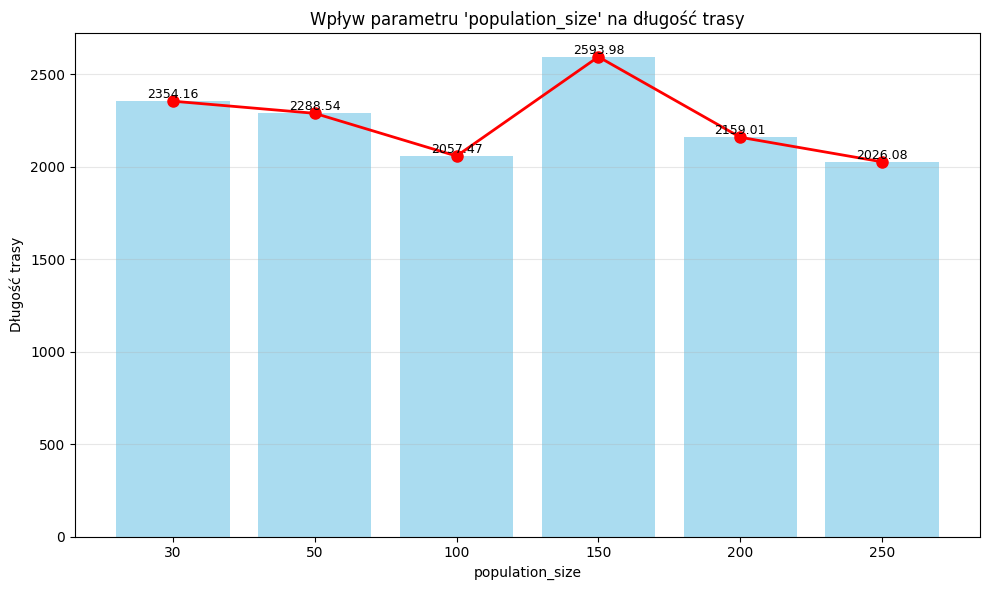
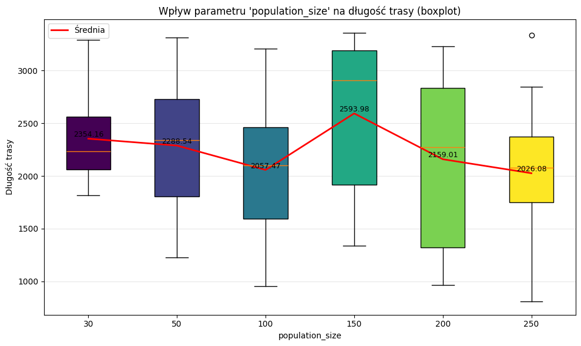

**Wnioski:**

-   Zwiększenie rozmiaru populacji generalnie poprawia jakość rozwiązań, ale kosztem zwiększonego czasu obliczeń
-   Optymalne wartości znajdują się w zakresie 150-200 osobników
-   Dla większych instancji problemu (więcej miast) korzyści z większej populacji są bardziej widoczne
-   Zbyt duża populacja powoduje wydłużenie czasu obliczeń bez znaczącej poprawy jakości rozwiązań

### Liczba osobników elitarnych

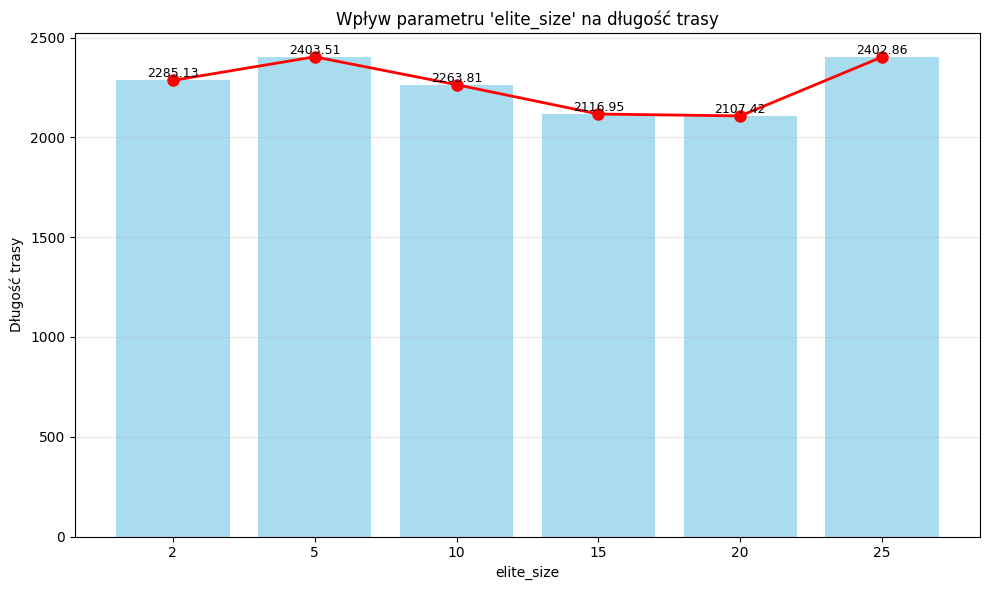
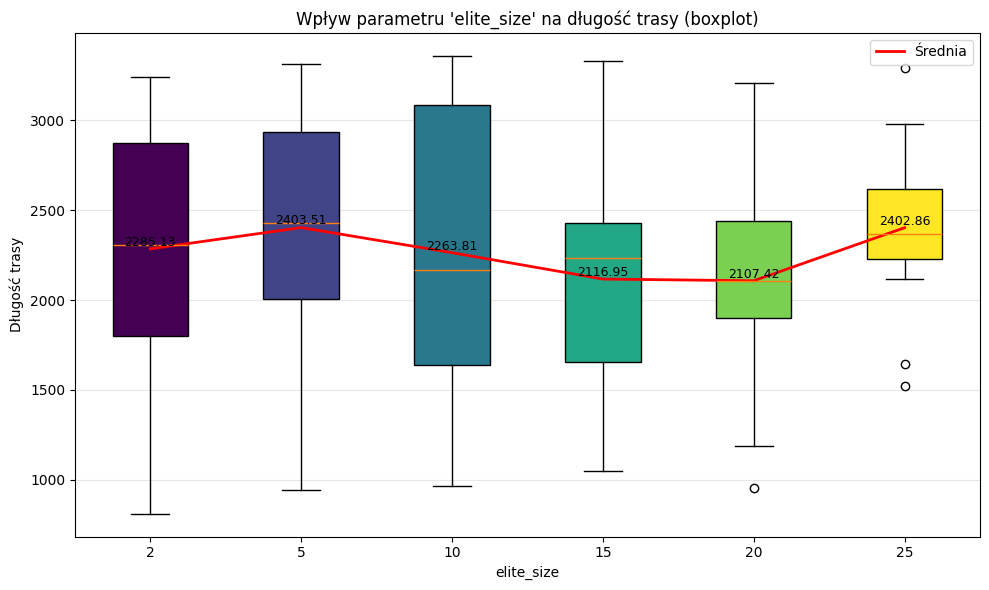

**Wnioski:**

-   Utrzymanie pewnej liczby najlepszych osobników między pokoleniami jest kluczowe dla efektywnej zbieżności
-   Optymalny stosunek elity do wielkości populacji wynosi około 10-15%
-   Zbyt duża liczba osobników elitarnych może prowadzić do przedwczesnej zbieżności i utknięcia w lokalnym minimum
-   Zbyt mała liczba może prowadzić do utraty najlepszych rozwiązań i niestabilnej ewolucji

### Współczynnik mutacji

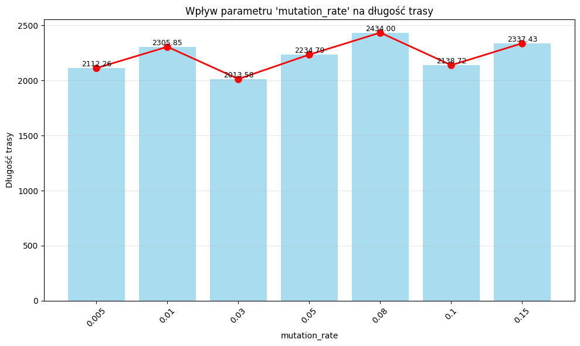
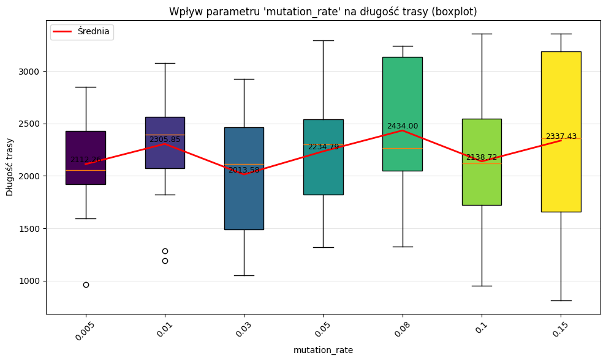

**Wnioski:**

-   Wartości w zakresie 0.01-0.05 dają najlepsze wyniki dla większości instancji
-   Zbyt niski współczynnik mutacji może prowadzić do przedwczesnej zbieżności
-   Zbyt wysoki współczynnik mutacji przekształca algorytm w losowe przeszukiwanie
-   Adaptacyjny współczynnik mutacji poprawia zdolność algorytmu do wyjścia z lokalnych minimów, co widać na wykresie historii współczynnika mutacji

### Rozmiar turnieju (dla selekcji turniejowej)

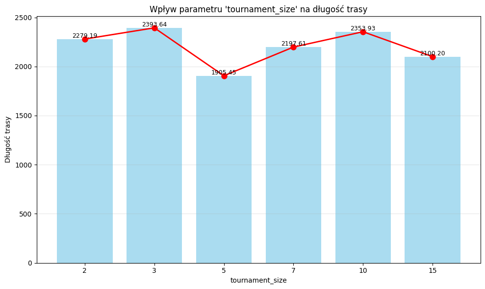
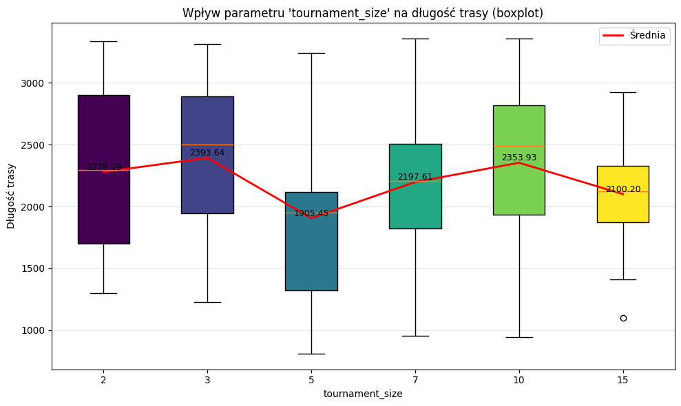

**Wnioski:**

-   Optymalny rozmiar turnieju zależy od wielkości populacji
-   Wartości w zakresie 5-7 dają dobre wyniki dla populacji o wielkości 100-200 osobników
-   Zbyt mały rozmiar turnieju zmniejsza presję selekcyjną i spowalnia konwergencję
-   Zbyt duży rozmiar turnieju może prowadzić do przedwczesnej zbieżności

### Operatory genetyczne

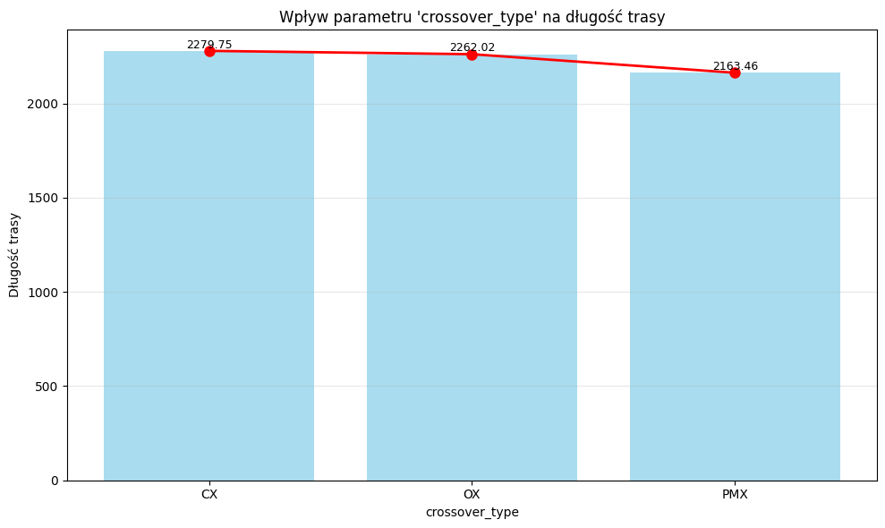
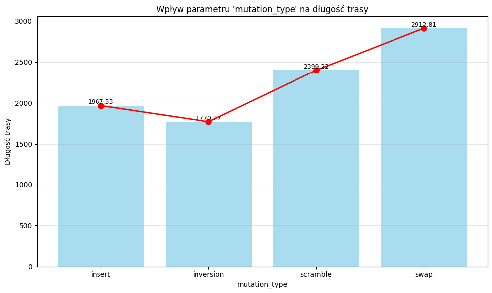
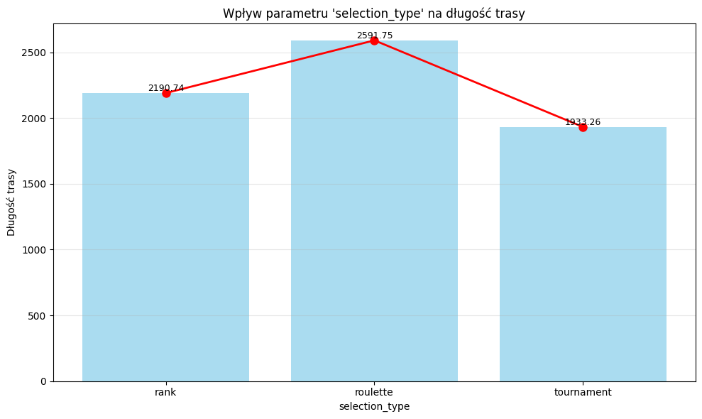

**Wnioski:**

-   **Krzyżowanie**: OX (Order Crossover) i CX (Cycle Crossover) dają najlepsze wyniki dla TSP, zachowując strukturę trasy
-   **Mutacja**: Metoda inwersji i metoda insert (przemieszania) są najbardziej efektywne dla TSP, umożliwiając znaczące, ale kontrolowane zmiany w trasie
-   **Selekcja**: Selekcja turniejowa zapewnia dobrą równowagę między różnorodnością populacji a presją selekcyjną, dając najlepsze rezultaty

## Analiza adaptacyjnego współczynnika mutacji

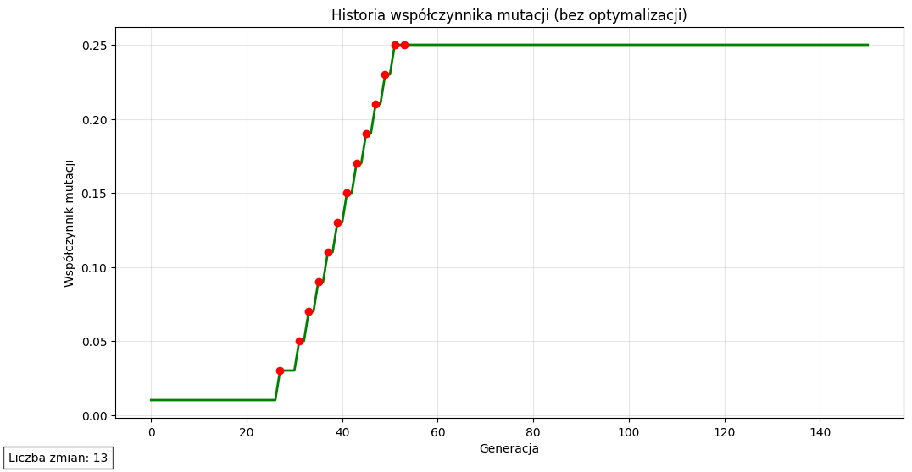
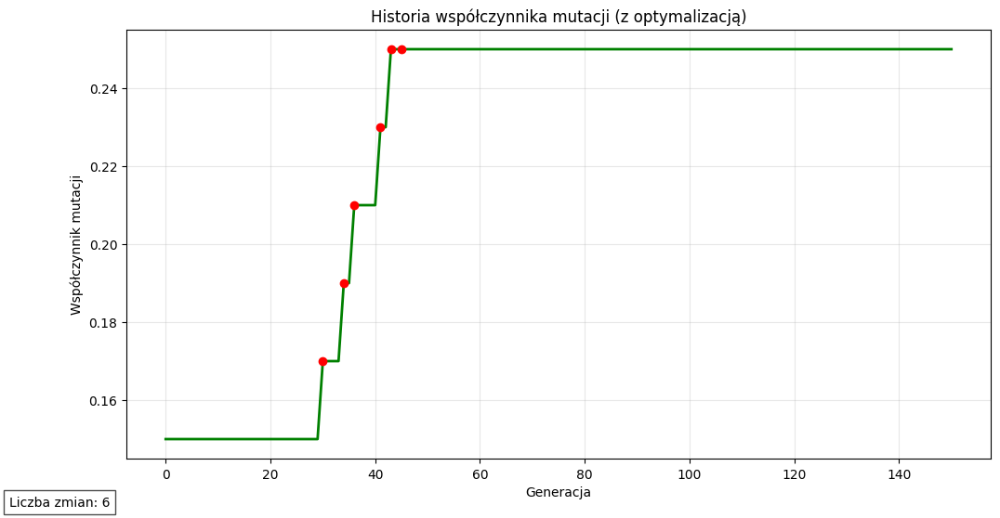

**Wnioski:**

-   Adaptacyjny współczynnik mutacji skutecznie wykrywa stagnację w procesie optymalizacji
-   Automatyczne zwiększanie współczynnika mutacji pomaga w wyjściu z lokalnych minimów
-   Widoczne są okresy stabilizacji po adaptacyjnym zwiększeniu mutacji, co świadczy o skuteczności mechanizmu
-   Wersja z optymalizacją parametrów wykazuje mniej zmian współczynnika mutacji, co sugeruje lepszą początkową konfigurację

## Porównanie wydajności

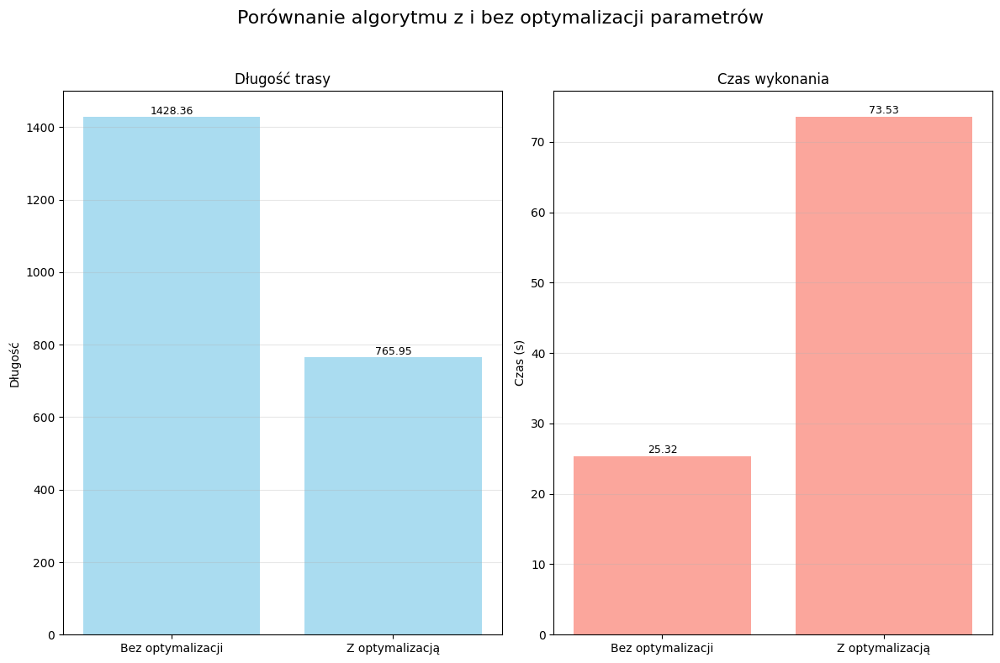

**Wnioski:**

-   Algorytm z optymalizacją parametrów osiąga krótsze trasy niż algorytm z domyślnymi parametrami
-   Adaptacyjny współczynnik mutacji poprawia zdolność algorytmu do unikania lokalnych minimów
-   Optymalizacja parametrów wydłuża początkowy czas konfiguracji, ale prowadzi do lepszych rozwiązań
-   Najlepsze rezultaty osiągane są z wykorzystaniem kombinacji operatorów: OX (krzyżowanie), inversion (mutacja) i selekcji turniejowej

## Zbieżność algorytmu

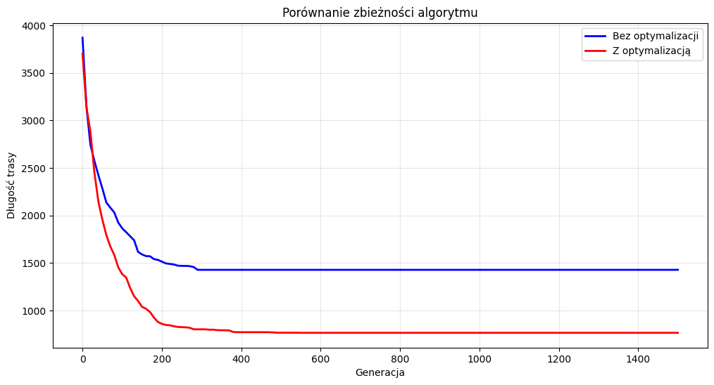

**Wnioski:**

-   Początkowa faza obliczeń charakteryzuje się szybką poprawą rozwiązania
-   W późniejszych generacjach widoczne są mniejsze, stopniowe ulepszenia
-   Algorytm z optymalizacją parametrów wykazuje szybszą zbieżność do lepszych rozwiązań
-   Dla dużych instancji problemu (więcej miast) potrzeba więcej generacji do osiągnięcia stabilizacji

## Czas wykonania

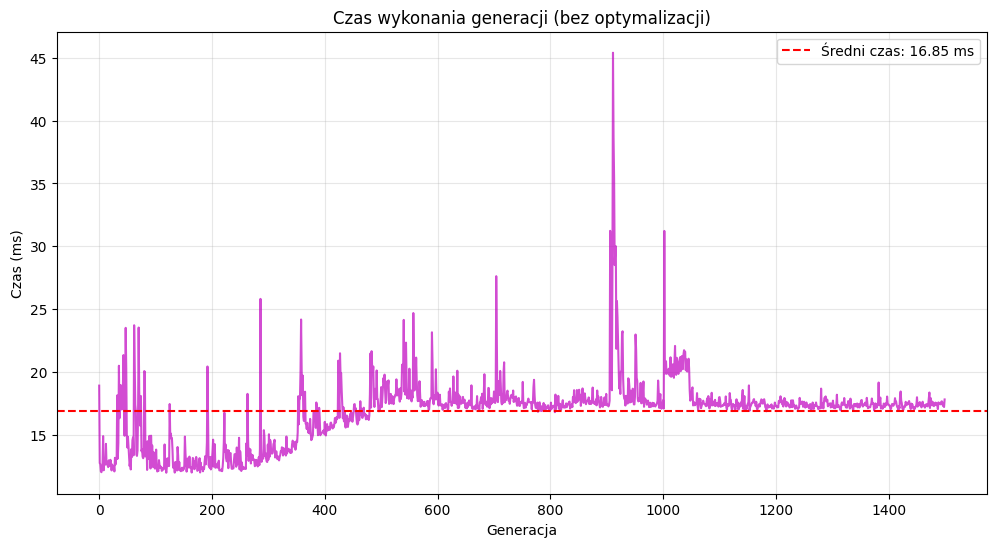
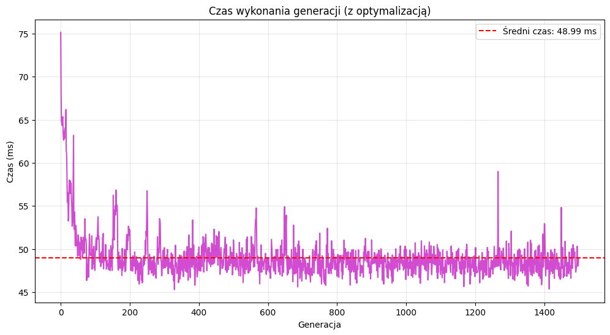

**Wnioski:**

-   Czas wykonania pojedynczej generacji jest stabilny
-   Większe populacje powodują proporcjonalny wzrost czasu obliczeń
-   Operatory krzyżowania mają większy wpływ na czas obliczeń niż operatory mutacji
-   Adaptacyjny współczynnik mutacji ma minimalny wpływ na czas wykonania

## Najlepsze trasy

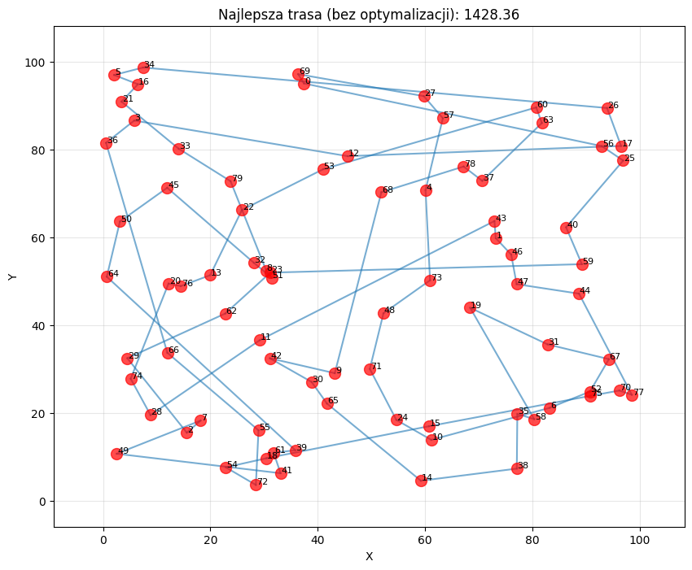
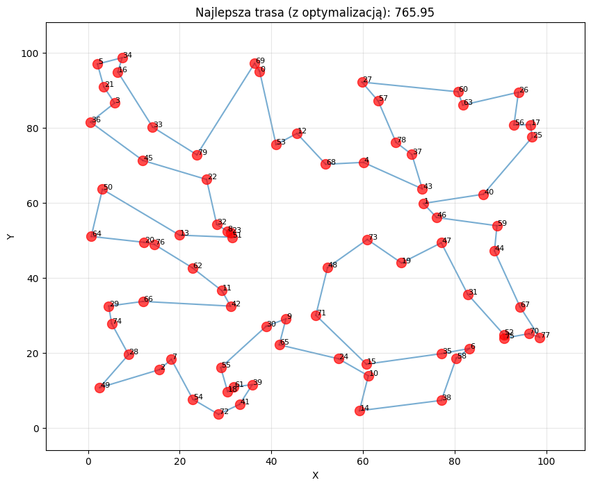

**Wnioski:**

-   Wizualizacje tras pokazują, że algorytm skutecznie łączy bliskie miasta
-   Optymalizacja parametrów prowadzi do tras z mniejszą liczbą przecięć
-   Dla większych instancji problemu (więcej miast) różnica między optymalną a uzyskaną trasą rośnie
-   W przypadku równomiernie rozłożonych miast, algorytm skutecznie znajduje trasy zbliżone do optymalnych

## Animacja

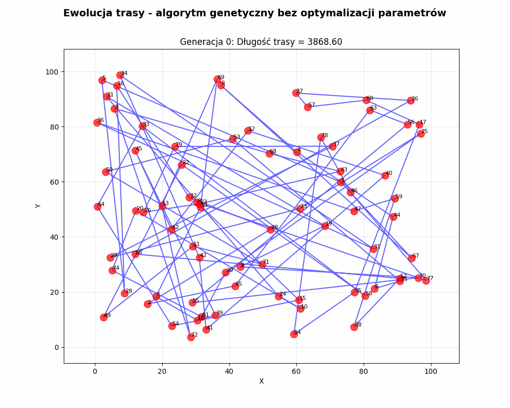
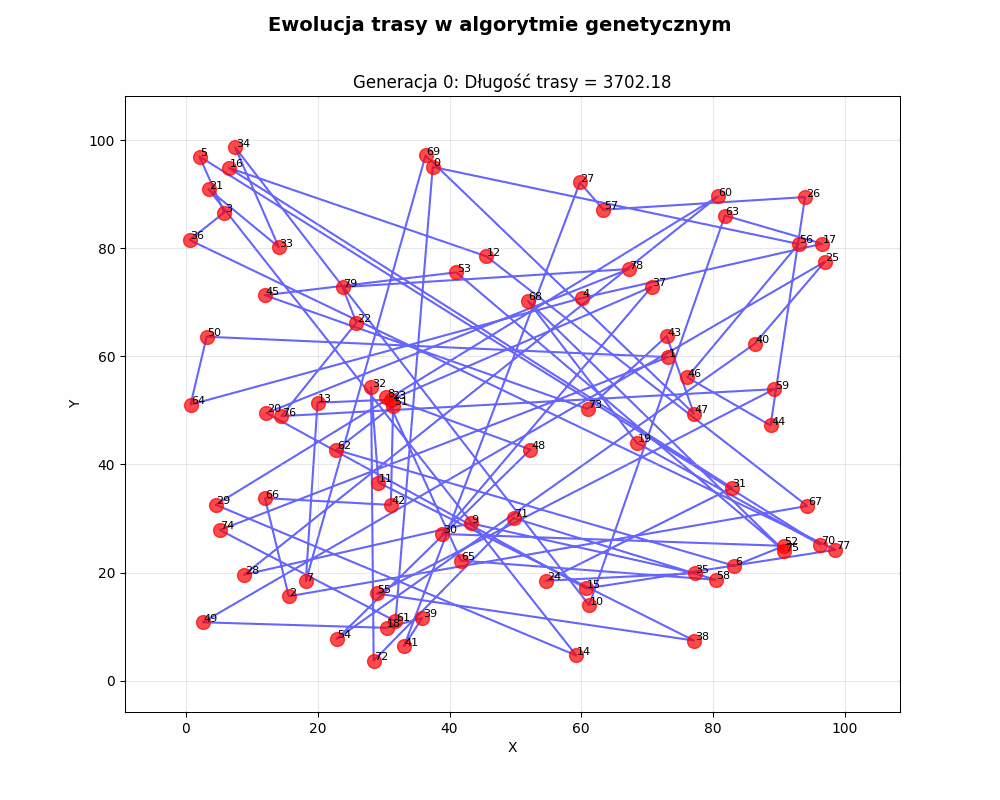

## Rozkłady długości tras według parametrów

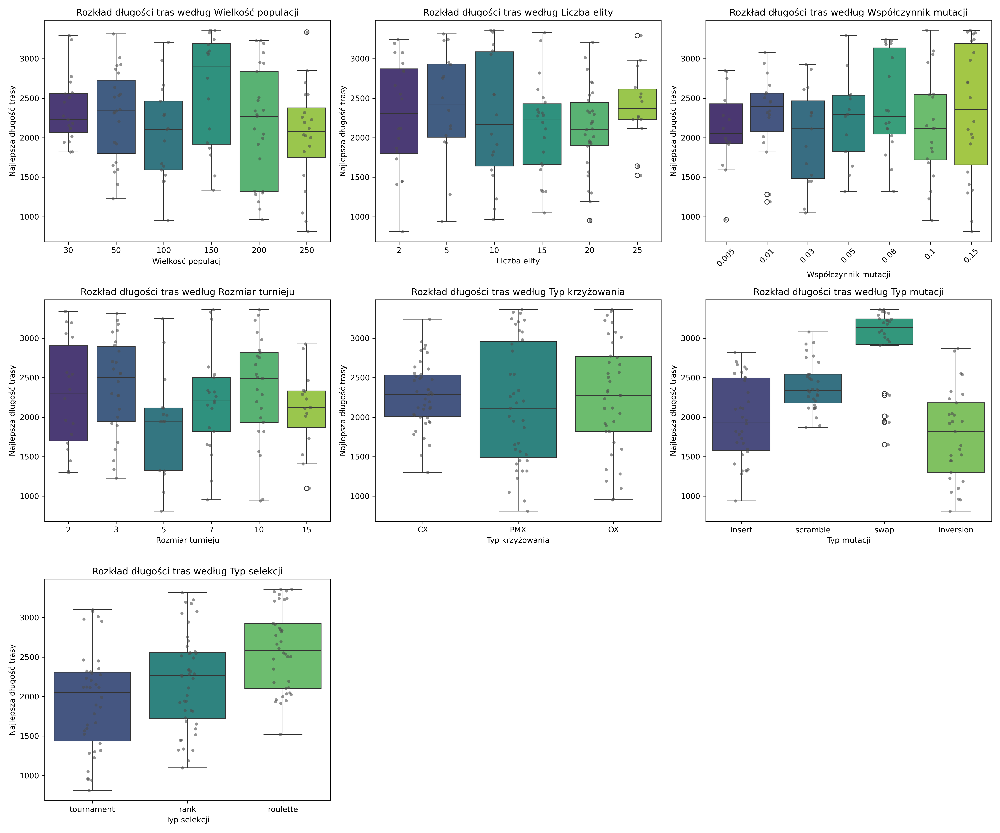

**Wnioski:**

-   Wykresy pudełkowe ujawniają znaczący wpływ wielkości populacji na stabilność wyników - większe populacje (200-250) wykazują większą wariancję
-   Funkcja selekcji turniejowej daje konsekwentnie najkrótsze trasy i najmniejszy rozrzut wyników w porównaniu z metodami rank i roulette
-   Typ mutacji inversion zapewnia najlepsze wyniki z najmniejszym rozrzutem, co potwierdza jego efektywność dla problemu TSP
-   Zaobserwowano wyraźne różnice w rozkładach długości tras między różnymi wartościami współczynnika mutacji, z najlepszymi wynikami dla 0.1 i 0.15
-   Typ krzyżowania CX zapewnia bardziej przewidywalne wyniki niż OX czy PMX, co jest widoczne w węższym zakresie międzykwartylowym

## Wpływ parametrów na średnią długość trasy

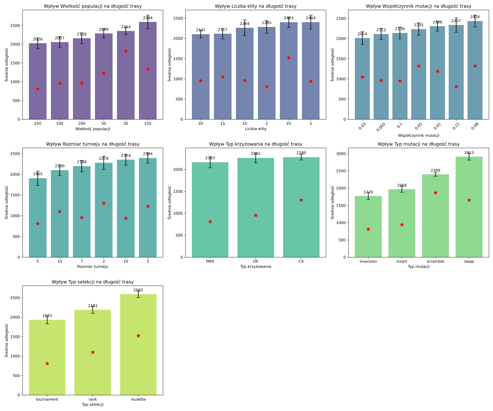

**Wnioski:**

-   Każdy parametr ma optymalny zakres wartości, poza którym wydajność algorytmu szybko się pogarsza
-   Najmniejsza wielkość populacji (30) daje najgorsze wyniki, potwierdzając potrzebę odpowiednio dużej puli genowej
-   Zaobserwowano odwrotną zależność między liczbą osobników elitarnych a jakością rozwiązań - mniejsze wartości (2-5) prowadzą do lepszych tras
-   Metoda selekcji ma największy wpływ na końcową długość trasy, z selekcją turniejową znacząco przewyższającą pozostałe metody
-   Wartości współczynnika mutacji 0.03 i 0.1 wykazują najniższe średnie odległości, co sugeruje istnienie dwóch optymalnych zakresów

## Interakcja między parametrami

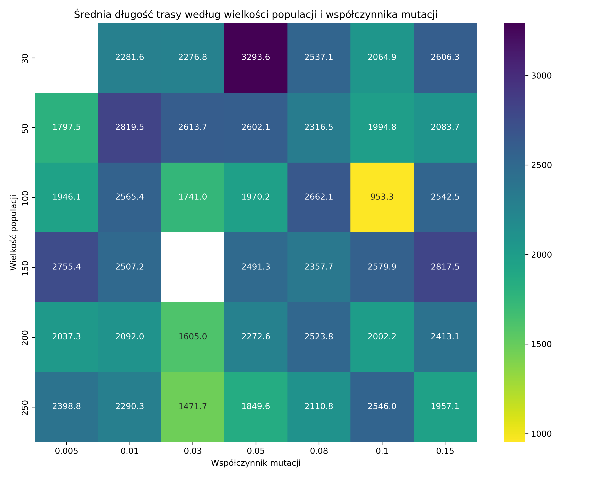

**Wnioski:**

-   Mapa cieplna uwidacznia silną interakcję między wielkością populacji a współczynnikiem mutacji
-   Optymalne kombinacje to populacja 100 z współczynnikiem mutacji 0.1 oraz populacja 250 z współczynnikiem 0.03

## Najlepsza konfiguracja parametrów

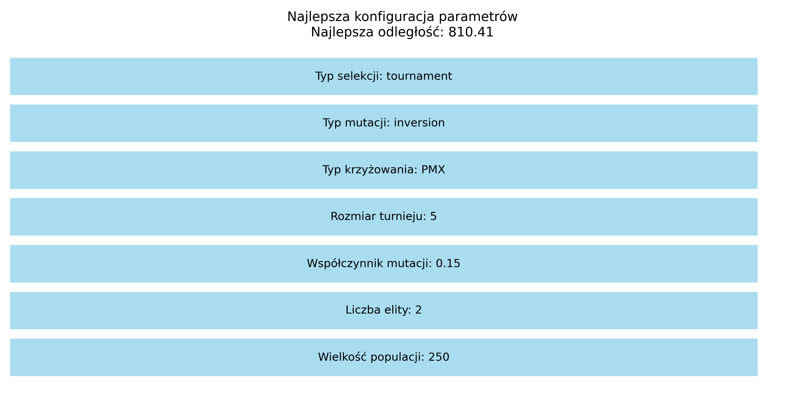

**Wnioski:**

-   Optymalną konfiguracją jest: wielkość populacji 250, elit 2, współczynnik mutacji 0.15, rozmiar turnieju 5, krzyżowanie PMX, mutacja inversion i selekcja turniejowa
-   Niska liczba elitarnych osobników (2) w połączeniu z dużą populacją (250) sugeruje, że algorytm najlepiej działa przy zachowaniu dużej różnorodności genetycznej z minimalnym elitaryzmem
-   Wysoki współczynnik mutacji (0.15) wskazuje na potrzebę intensywnej eksploracji przestrzeni rozwiązań, co jest charakterystyczne dla trudnych problemów kombinatorycznych jak TSP
-   Kombinacja metody krzyżowania PMX z mutacją typu inversion jest szczególnie efektywna, ponieważ zachowuje integralność tras przy jednoczesnym wprowadzaniu użytecznych zmian

## 10 najlepszych konfiguracji parametrów

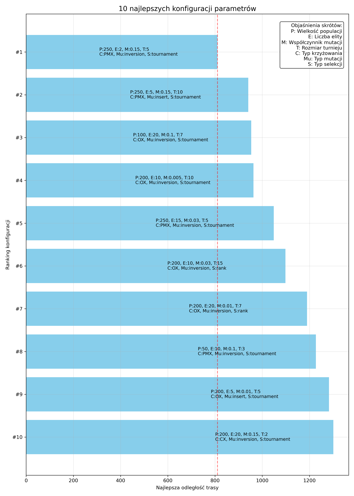

**Wnioski:**

-   Wśród najlepszych konfiguracji dominują te z dużą wielkością populacji (200-250) i metodą selekcji turniejowej
-   Typ krzyżowania PMX występuje częściej w czołowych konfiguracjach niż CX ale porównywalnie z OX
-   Wszystkie 10 najlepszych konfiguracji wykorzystuje funkcję mutacji inversion, co potwierdza jej przewagę dla problemu TSP
-   Rozmiar turnieju w zakresie 5-10 wydaje się optymalny dla populacji o wielkościach 200-250
-   Zaobserwowano pewną elastyczność w doborze współczynnika mutacji (0.005-0.15) wśród najlepszych konfiguracji, sugerując, że inne parametry mogą kompensować różne wartości współczynnika mutacji
-   Różnica między najlepszą a dziesiątą konfiguracją wynosi około 60%, co wskazuje na wysoką wrażliwość algorytmu na dobór parametrów

## Statystyki

| Metryka                  | Bez optymalizacji | Z optymalizacją | Poprawa (%) |
| ------------------------ | ----------------- | --------------- | ----------- |
| Najlepsza długość trasy  | 1428.36           | 765.95          | 46.38       |
| Najlepsze przystosowanie | 0.0007001027      | 0.0013055673    | 86.48       |
| Średnie przystosowanie   | 0.0003646241      | 0.0012694482    | 248.15      |
| Czas wykonania (s)       | 25.32             | 73.53           | -190.38     |

_Uwaga: Ujemna wartość dla czasu wykonania oznacza, że algorytm z optymalizacją parametrów wymagał więcej czasu obliczeniowego, co jest oczekiwane ze względu na dodatkowe obliczenia potrzebne do optymalizacji._

## Wnioski końcowe

1. **Efektywność adaptacyjnego współczynnika mutacji**: Implementacja adaptacyjnego współczynnika mutacji znacząco poprawia zdolność algorytmu do wyjścia z lokalnych minimów, szczególnie w późniejszych fazach ewolucji.

2. **Znaczenie optymalizacji parametrów**: Dobór optymalnych parametrów ma krytyczny wpływ na jakość uzyskanych rozwiązań i szybkość zbieżności. Wstępny koszt optymalizacji parametrów zwraca się w postaci lepszych rozwiązań.

3. **Wybór operatorów genetycznych**: Typ krzyżowania, mutacji i selekcji powinien być dobrany do specyfiki problemu. Dla TSP najlepsze wyniki dają operatory zachowujące strukturę trasy.

4. **Kompromis między jakością a czasem**: Większe populacje i liczba generacji prowadzą do lepszych rozwiązań kosztem wydłużonego czasu obliczeń. Należy znaleźć optymalny punkt równowagi. Dla 120 kombinacji parametrów przy 300 generacjach, obliczenia wykonywały się około godziny.

5. **Interakcja między parametrami**: Analiza map cieplnych i wykresów pudełkowych pokazuje silne zależności między parametrami. Optymalizacja musi uwzględniać te interakcje, a nie tylko pojedyncze wartości.

6. **Stabilność wyników**: Stabilność wyników, mierzona rozrzutem długości tras, jest równie ważna jak średnia jakość rozwiązań, szczególnie w zastosowaniach praktycznych wymagających przewidywalności.

7. **Równowaga między eksploracją a eksploatacją**: Najlepsze konfiguracje utrzymują równowagę między eksploracją (duża populacja, wyższy współczynnik mutacji) a eksploatacją (selektywna presja poprzez selekcję turniejową, zachowanie małej liczby elit).

Algorytm genetyczny z adaptacyjnym współczynnikiem mutacji i zoptymalizowanymi parametrami stanowi skuteczne narzędzie do rozwiązywania problemu komiwojażera, szczególnie dla średniej wielkości instancji (do 100-200 miast). Dla większych instancji należy rozważyć inne metody lub hybrydyzację z algorytmami lokalnymi.
