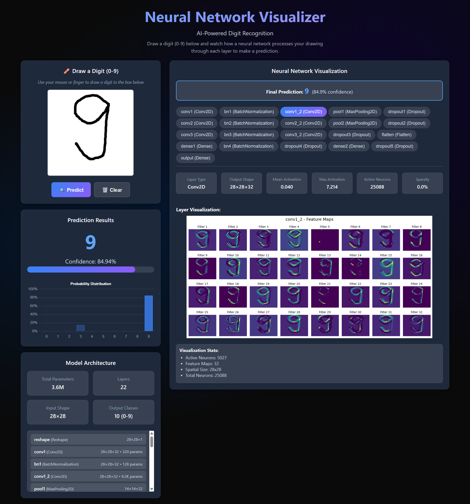
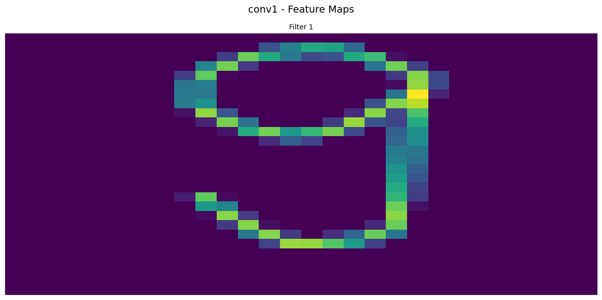
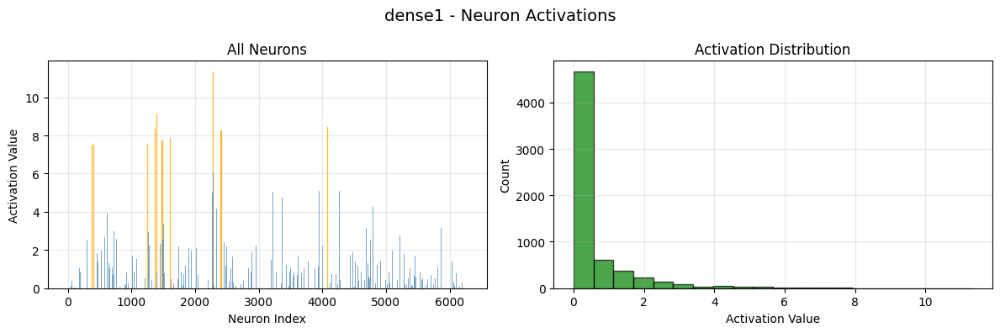
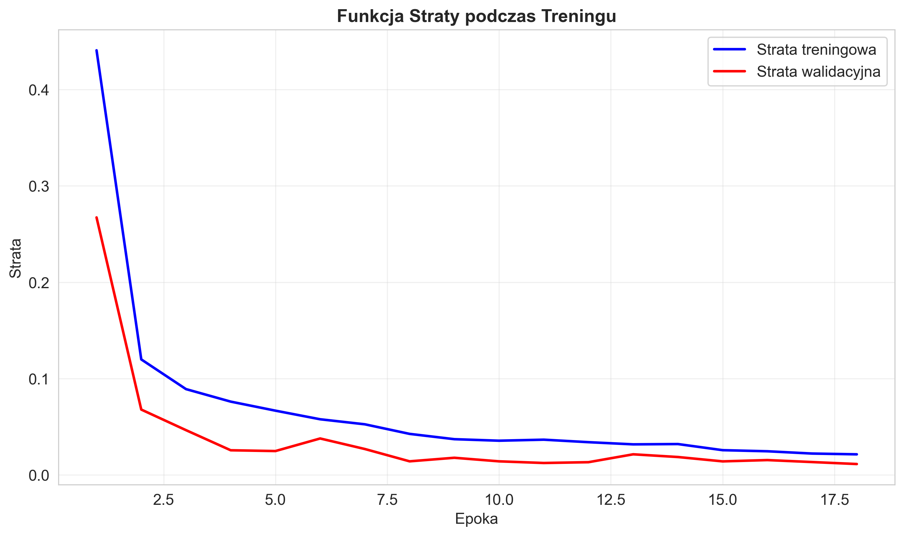
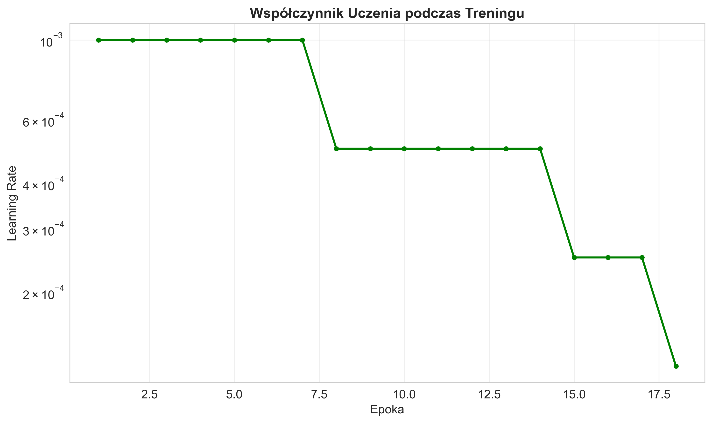
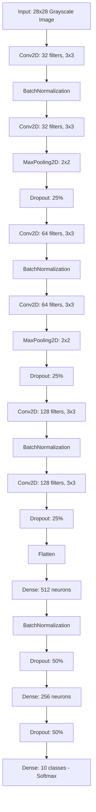

# 🧠 Neural Network Visualization App

<div align="center">


**AI-Powered Digit Recognition with Real-Time Neural Network Visualization**

_An interactive full-stack application that demonstrates how Convolutional Neural Networks process handwritten digits with live visualization of each layer's activations_

</div>

---

## 🎯 Demo & Screenshots

### 🎬 Live Application Demo

<div align="center">

**Watch the Neural Network in Action**

<<<<<<< HEAD
<video controls>
  <source src="https://www.youtube.com/watch?v=ucLcYAWXpMU" type="video/mp4">
</video>
=======
[https://www.youtube.com/watch?v=ucLcYAWXpMU&ab_channel=BartoszIrzyk](https://github.com/user-attachments/assets/29ab24e1-caec-4767-8c62-52e19633a9b4)
>>>>>>> 3cb5632107d358fbc4bc1a3dc333abf01e515a1f

_Complete application walkthrough showing real-time digit recognition, neural network visualization, and interactive features_

</div>

### 🖥️ Main Application Interface

<div align="center">



_Interactive web interface featuring dark theme design with real-time digit recognition and neural network visualization_

</div>

### 🔍 Neural Network Layer Visualizations

<table>
<tr>
<td width="50%">

**Convolutional Layers**

_Feature maps showing edge detection and pattern recognition_

</td>
<td width="50%">

**Dense Layer Activations**

_Abstract feature representations in fully connected layers_

</td>
</tr>
</table>

### 📊 Training Performance Analysis

<table>
<tr>
<td width="33%">


_Loss convergence over training epochs_

</td>
<td width="33%">


_Accuracy improvement during training_

</td>
<td width="33%">


_Adaptive learning rate scheduling_

</td>
</tr>
</table>

---

## ✨ Key Features

<table>
<tr>
<td width="25%" align="center">

### 🎨 Interactive Drawing

Draw digits (0-9) on HTML5 canvas with real-time prediction

</td>
<td width="25%" align="center">

### 🧠 Neural Network Visualization

Live visualization of activations through all network layers

</td>
<td width="25%" align="center">

### 📈 Performance Analytics

Comprehensive training analysis with Polish documentation

</td>
<td width="25%" align="center">

### 🌙 Modern UI

Dark theme interface with gradient effects and responsive design

</td>
</tr>
</table>

---

## 🚀 Tech Stack

<div align="center">

|                                       **Frontend**                                        |                                         **Backend**                                          |                                                **ML/AI**                                                 |                                              **DevOps**                                               |
| :---------------------------------------------------------------------------------------: | :------------------------------------------------------------------------------------------: | :------------------------------------------------------------------------------------------------------: | :---------------------------------------------------------------------------------------------------: |
|  |     |  |           |
|  |  |                 |  |
|     |     |              |                    |

</div>

---

## 🏗️ Architecture

### 🧠 Neural Network Architecture



### 📊 Model Performance

|       **Metric**        | **Value**  |
| :---------------------: | :--------: |
|  **Training Accuracy**  |   99.39%   |
| **Validation Accuracy** | **99.61%** |
|  **Total Parameters**   |   ~2.3M    |
|   **Training Epochs**   |     18     |
| **Final Learning Rate** |  0.000125  |

---

## 🚀 Quick Start

### 📋 Prerequisites

-   [Docker](https://docs.docker.com/get-docker/) & [Docker Compose](https://docs.docker.com/compose/install/)
-   [Git](https://git-scm.com/downloads)

### ⚡ Installation

1. **Clone the repository**

```bash
git clone git@github.com:birzyk6/inteligencja-obliczeniowa.git
cd neural_networks_project
```

2. **Launch with Docker Compose**

```bash
docker-compose up --build
```

3. **Access the application**
    - 🌐 **Frontend**: [http://localhost:3000](http://localhost:3000)
    - 🔗 **Backend API**: [http://localhost:5000](http://localhost:5000)

---

## 🎮 How to Use

<div align="center">

### 1️⃣ Draw → 2️⃣ Process → 3️⃣ Visualize → 4️⃣ Analyze

</div>

1. **🎨 Draw a digit** on the interactive canvas
2. **⚡ Real-time processing** by the neural network
3. **🔍 Visualize activations** through each layer
4. **📊 Analyze predictions** with confidence scores

---

## 🔌 API Endpoints

| **Method** |   **Endpoint**    | **Description**                               |
| :--------: | :---------------: | :-------------------------------------------- |
|   `POST`   |  `/api/predict`   | 🎯 Predict drawn digit with confidence scores |
|   `POST`   | `/api/visualize`  | 🔍 Get layer-by-layer network visualization   |
|   `GET`    | `/api/model-info` | ℹ️ Retrieve model architecture information    |

---

## 📁 Project Structure

```
neural_networks_project/
├── 📱 frontend/                 # React application
│   ├── src/
│   │   ├── App.js              # Main application component
│   │   ├── components/         # React components
│   │   │   ├── DrawingCanvas.js
│   │   │   ├── PredictionDisplay.js
│   │   │   ├── NetworkVisualization.js
│   │   │   └── ModelInfo.js
│   │   └── index.js
│   ├── public/
│   └── Dockerfile
├── 🔧 backend/                  # Flask API server
│   ├── app.py                  # Main Flask application
│   ├── model/                  # Neural network implementation
│   │   ├── neural_network.py   # CNN model definition
│   │   ├── trained_model.h5    # Pre-trained weights
│   │   └── training_history.json
│   ├── utils/                  # Utility functions
│   │   ├── image_processing.py
│   │   └── visualization.py
│   └── Dockerfile
├── 📊 plots/                    # Generated visualizations
│   ├── training_plots/         # Training analysis charts
│   └── *_feature_maps.png      # Layer activation visualizations
├── 📈 training_analysis.ipynb   # Jupyter notebook with analysis
├── 📋 WNIOSKI.md               # Polish conclusions document
├── 🐳 docker-compose.yml       # Container orchestration
└── 📖 README.md                # This file
```

---

## 🏆 Key Achievements

-   **🎯 99.61% Validation Accuracy** - Superior performance on MNIST dataset
-   **🚫 Zero Overfitting** - Validation accuracy exceeds training accuracy
-   **⚡ Real-time Inference** - Instant digit recognition and visualization
-   **🎨 Modern UI/UX** - Professional dark theme with gradient effects
-   **📊 Comprehensive Analysis** - Complete training metrics and visualizations
-   **🐳 Containerized Deployment** - Easy setup with Docker Compose

---

## 📄 License

This project is licensed under the MIT License - see the [LICENSE](LICENSE) file for details.

---
