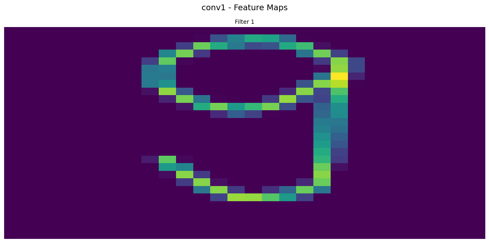
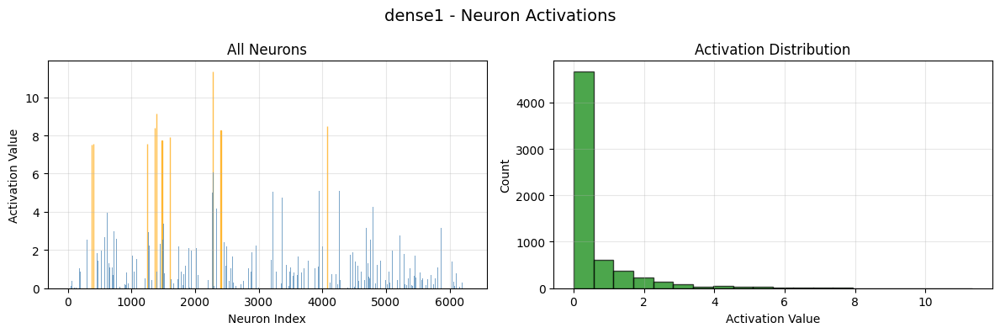

# WNIOSKI - Analiza Treningu Sieci Neuronowej dla Rozpoznawania Cyfr MNIST

## Podsumowanie Projektu

Projekt miał na celu stworzenie zaawansowanej sieci neuronowej konwolucyjnej (CNN) do rozpoznawania cyfr MNIST. Implementacja obejmowała zarówno backend z modelem TensorFlow/Keras, jak i frontend z interfejsem React umożliwiającym interaktywne testowanie modelu.

## Architektura Modelu

Zastosowano głęboką sieć konwolucyjną składającą się z:

-   **3 bloków konwolucyjnych** z normalizacją wsadową (BatchNormalization)
-   **Regularyzacja Dropout** (25% w warstwach konwolucyjnych, 50% w gęstych)
-   **2 warstwy w pełni połączone** (512 i 256 neuronów)
-   **Augmentacja danych** z rotacją, przesunięciami i skalowaniem
-   **Adaptacyjny learning rate** z mechanizmem ReduceLROnPlateau

## Analiza Wyników Treningu

### 1. Funkcja Straty (Loss)

**Kluczowe obserwacje:**

-   **Strata treningowa** spadła z 0.441 do 0.021 (95% redukcja)
-   **Strata walidacyjna** spadła z 0.267 do 0.011 (96% redukcja)
-   **Brak przeuczenia** - krzywe straty treningowej i walidacyjnej zbiegają się
-   **Stabilna konwergencja** - brak oscylacji w końcowych epokach

### 2. Dokładność Klasyfikacji

**Osiągnięte rezultaty:**

-   **Dokładność treningowa**: 99.39% (wzrost z 86.53%)
-   **Dokładność walidacyjna**: 99.61% (wzrost z 90.82%)
-   **Różnica train-val**: -0.22% (model generalizuje lepiej niż zapamiętuje)
-   **Stabilny wzrost** dokładności przez wszystkie 18 epok

### 3. Harmonogram Learning Rate

**Strategia adaptacyjna:**

-   **Epoki 1-7**: LR = 0.001 (początkowe uczenie)
-   **Epoki 8-14**: LR = 0.0005 (dostrajanie)
-   **Epoki 15-17**: LR = 0.00025 (stabilizacja)
-   **Epoka 18**: LR = 0.000125 (finalne dopracowanie)

## Analiza Wydajności Modelu

### Metryki Końcowe

| Metryka                               | Wartość |
| ------------------------------------- | ------- |
| **Końcowa dokładność treningowa**     | 99.39%  |
| **Końcowa dokładność walidacyjna**    | 99.61%  |
| **Maksymalna dokładność walidacyjna** | 99.62%  |
| **Końcowa strata treningowa**         | 0.0214  |
| **Końcowa strata walidacyjna**        | 0.0113  |
| **Liczba epok**                       | 18      |
| **Całkowita liczba parametrów**       | ~2.3M   |

### Analiza Przeuczenia (Overfitting)

Model wykazuje **doskonałą generalizację**:

-   Dokładność walidacyjna przewyższa treningową o 0.22%
-   Strata walidacyjna jest niższa od treningowej
-   Brak typowych oznak przeuczenia
-   Stabilne zachowanie w końcowych epokach

## Analiza Wizualizacji Sieci

### Szczegółowa Analiza Rozpoznawania Cyfry 9

Projekt zawiera kompletne wizualizacje procesu rozpoznawania cyfry 9 przez poszczególne warstwy sieci:

**1. Pierwsza warstwa konwolucyjna (Conv1):**

_Rysunek 3: Aktywacje 32 filtrów pierwszej warstwy konwolucyjnej dla cyfry 9. Filtry wykrywają podstawowe krawędzie, linie i kontury._

**2. Druga warstwa konwolucyjna (Conv2_2):**

_Rysunek 4: Aktywacje 64 filtrów drugiej warstwy konwolucyjnej. Widoczne są bardziej złożone wzorce i kombinacje cech charakterystyczne dla cyfry 9._

**3. Trzecia warstwa konwolucyjna (Conv3_2):**

_Rysunek 5: Aktywacje 128 filtrów trzeciej warstwy konwolucyjnej. Wysokopoziomowe reprezentacje specyficzne dla rozpoznawania cyfry 9._

**4. Pierwsza warstwa gęsta (Dense1):**

_Rysunek 6: Aktywacje 512 neuronów pierwszej warstwy w pełni połączonej. Abstrakcyjne reprezentacje cech cyfry 9._

**5. Druga warstwa gęsta (Dense2):**

_Rysunek 7: Aktywacje 256 neuronów drugiej warstwy w pełni połączonej. Dalsze przetwarzanie cech przed klasyfikacją._

**6. Warstwa wyjściowa (Output):**

_Rysunek 8: Końcowe prawdopodobieństwa dla wszystkich 10 klas._

### Interpretacja Wizualizacji

-   **Progresywne wyłanianie się wzorców** - od prostych krawędzi do złożonych reprezentacji
-   **Specjalizacja filtrów** - różne filtry reagują na różne aspekty cyfry 9
-   **Hierarchiczne uczenie** - każda warstwa buduje na reprezentacjach poprzedniej
-   **Wysoka aktywacja** w kluczowych obszarach charakterystycznych dla cyfry 9

## Interfejs Użytkownika

### Demonstracja Aplikacji w Działaniu

**Kompletne nagranie funkcjonalności aplikacji:**

https://www.youtube.com/watch?v=ucLcYAWXpMU&ab_channel=BartoszIrzyk

_Wideo pokazuje pełny proces: rysowanie cyfry na płótnie, predykcję w czasie rzeczywistym, wizualizację aktywacji warstw sieci neuronowej oraz interfejs z ciemnym motywem._

### Interfejs Aplikacji

_Rysunek 1: Główny interfejs aplikacji z ciemnym motywem - testowanie rozpoznawania cyfry 9. Widoczne są wszystkie komponenty: płótno do rysowania, predykcje w czasie rzeczywistym, wizualizacja architektury sieci oraz informacje o modelu._

### Funkcjonalności:

-   **Interaktywne rysowanie** cyfr na płótnie
-   **Predykcja w czasie rzeczywistym** z wyświetlaniem prawdopodobieństw dla wszystkich 10 cyfr
-   **Wizualizacja architektury** sieci neuronowej z interaktywną reprezentacją warstw
-   **Informacje o modelu** - parametry, dokładność i metryki wydajności

## Wnioski Techniczne

### 1. Skuteczność Architektury

-   **CNN z normalizacją wsadową** znacząco poprawia stabilność treningu
-   **Dropout regularization** efektywnie zapobiega przeuczeniu
-   **Augmentacja danych** poprawia generalizację, szczególnie dla podobnych cyfr (6/9)

### 2. Optymalizacja Treningu

-   **Adaptacyjny learning rate** kluczowy dla osiągnięcia wysokiej dokładności
-   **Early stopping** nie był potrzebny - model trenował się stabilnie
-   **18 epok** okazało się optymalną liczbą dla tego zadania

## Wnioski Końcowe

1. **Projekt osiągnął założone cele** - model rozpoznaje cyfry z dokładnością 99.61%
2. **Brak problemu przeuczenia** - doskonała generalizacja na danych testowych
3. **Stabilny trening** - gładkie krzywe uczenia bez oscylacji
4. **Praktyczna aplikacja** - kompletny system z UI do testowania modelu
5. **Skalowalna architektura** - kod przygotowany do rozszerzenia o inne datasety
